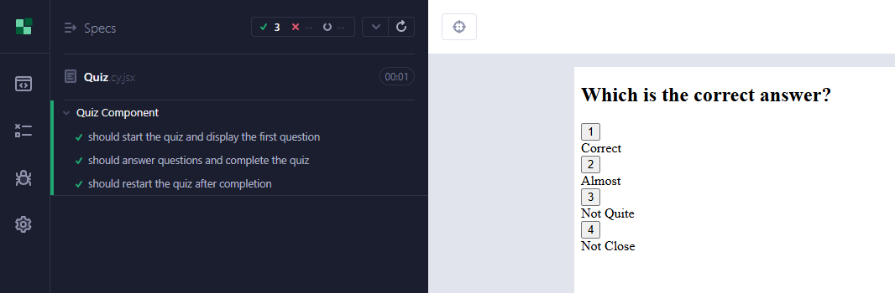

# Tech Quiz: CI/CD Setup with GitHub Actions and Render

This project demonstrates a full CI/CD pipeline using GitHub Actions to run Cypress component tests and automatically deploy a MERN stack application to Render.

## 🚀 Live Application

[View Deployed App on Render](https://ci-cd-github-actions-ci-cd-setup-am17.onrender.com)

## 🛠 Features

- Cypress tests run automatically on pull requests to the `develop` branch.
- Application is deployed automatically when `develop` is merged into `main`.
- MongoDB Atlas connected via environment variable.
- GitHub Actions used to automate testing and deployment.

## ✅ Cypress Testing Details

- Cypress is configured for **Component Testing** using `Quiz.cy.jsx` located in `cypress/component/`.
- Tests verify:
  - The quiz starts and displays the first question.
  - Users can answer questions and complete the quiz.
  - The quiz resets properly after completion.
- Tests are triggered automatically via GitHub Actions when a pull request is opened to the `develop` branch.
- All tests pass successfully in CI as shown in the screenshot below.

## 🖼️ Screenshot

## 📂 Tech Stack

- MongoDB Atlas
- Express.js
- React
- Node.js
- TypeScript
- Cypress
- GitHub Actions
- Render

## 📁 Repository

[GitHub Repository](https://github.com/iaplesnyc/CI-CD-GitHub-Actions-CI-CD-Setup)
